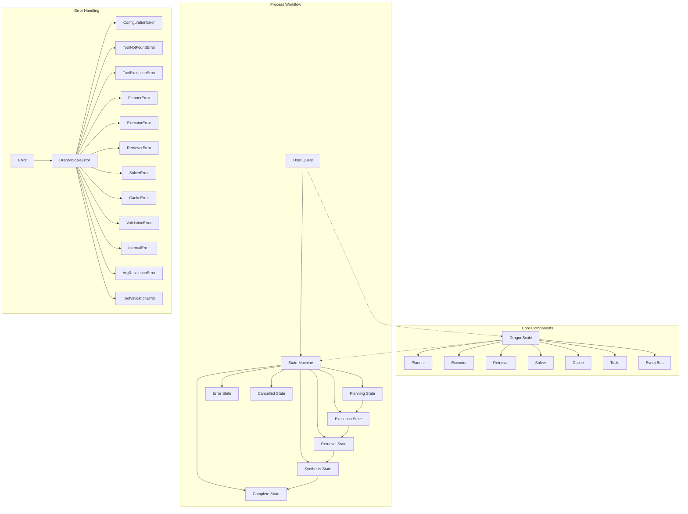
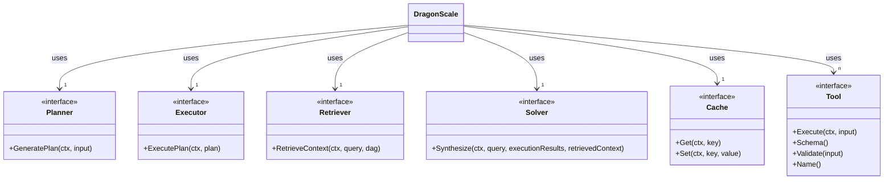
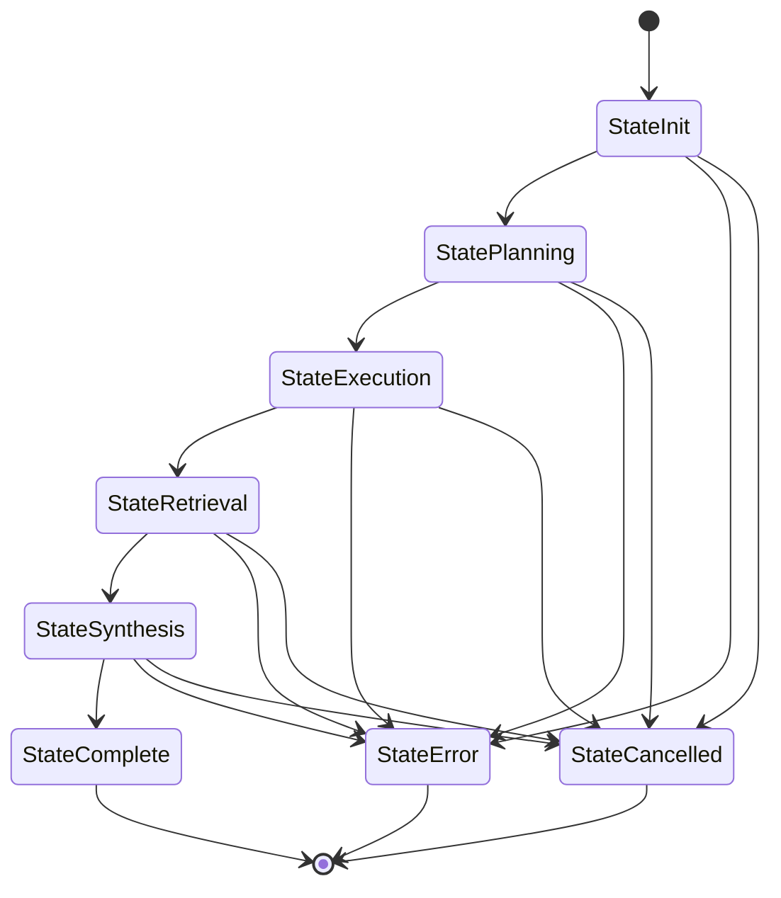
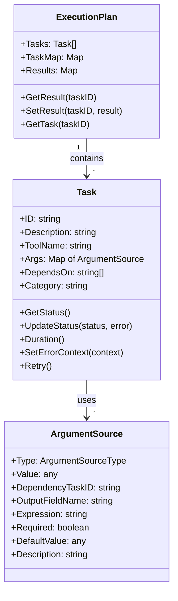
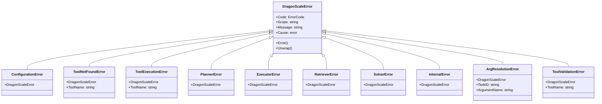
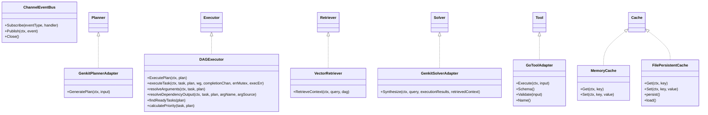
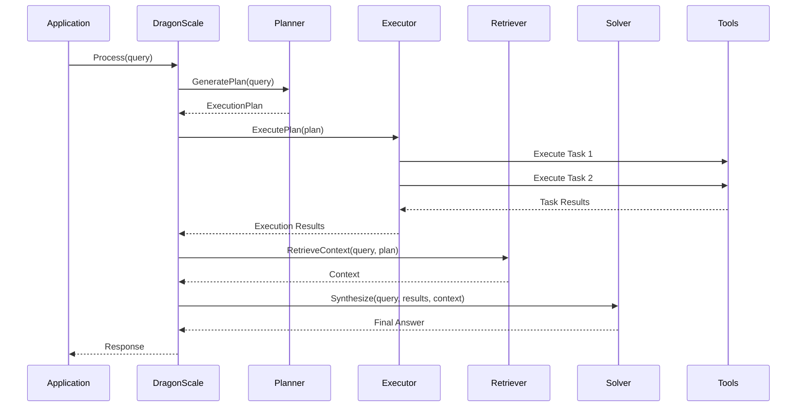
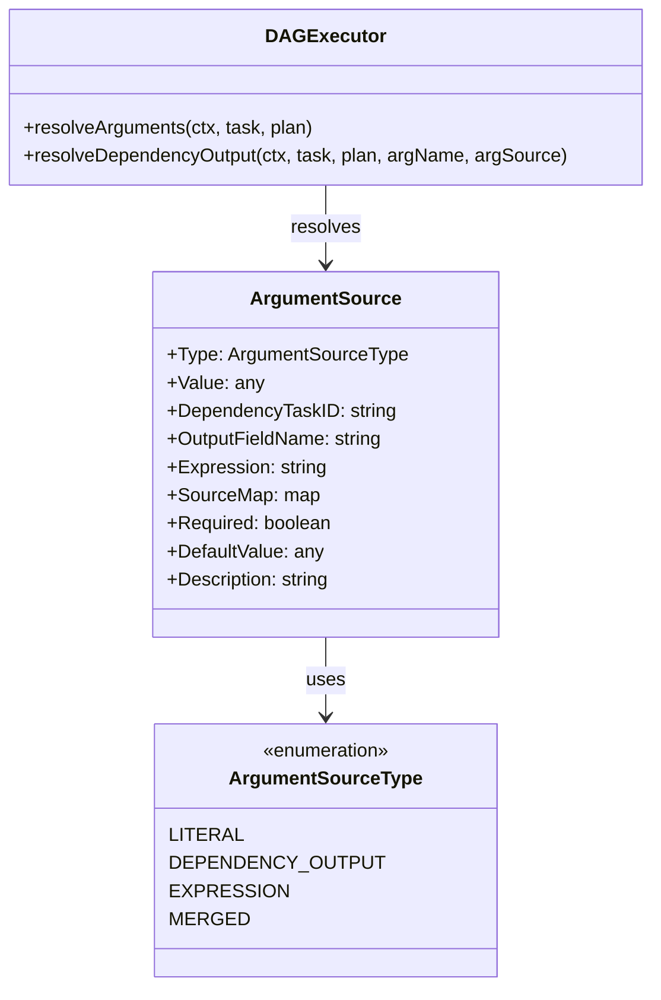

# DragonScale Genkit Architecture

This document provides a visual representation of the DragonScale Genkit architecture using UML diagrams.

## System Architecture Overview

DragonScale Genkit is a modular, extensible workflow automation framework powered by AI. It provides a structured approach to building AI-powered applications that can plan, execute, and solve complex tasks using tools and context retrieval.

## Core Interfaces

The system is built around key interfaces that enable modularity and extensibility.

## State Machine and Process Flow

The process workflow is handled by a state machine that manages transitions between states.

## Execution Model

The system executes tasks in a Directed Acyclic Graph (DAG) model.

## Error Handling System

The project implements a comprehensive error handling system.

## Component Implementations

The internal directory contains implementations of the core interfaces.

## Usage Flow

The typical usage flow in an application using DragonScale Genkit.

## Argument Resolution System

The system includes a robust argument resolution system for task execution.

